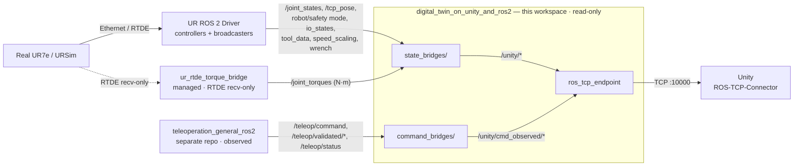
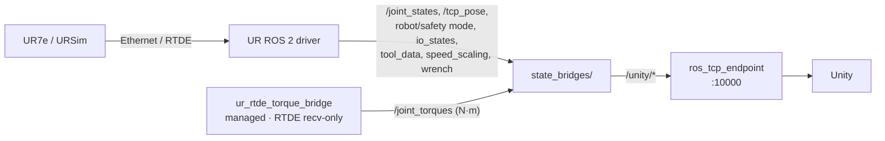
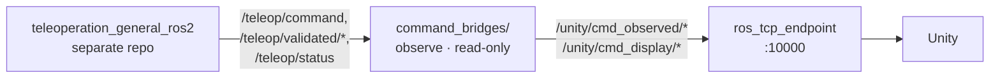
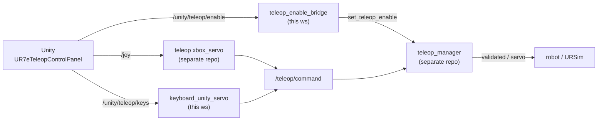

# Digital Twin on Unity and ROS 2

ROS 2 backend for a Unity-based digital twin of the Universal Robots **UR7e**
collaborative robot. It subscribes to the UR ROS 2 driver, converts robot state
into Unity-friendly messages, and streams them to Unity over the ROS-TCP-Endpoint.

- **Stage:** read-only state synchronisation, plus an optional Unity-driven
  teleoperation control stack (launched separately).
- **Platform:** ROS 2 Humble on Ubuntu 22.04 (WSL2 supported).
- **Robot:** Universal Robots UR7e (e-Series), real or URSim.

ROS 2 on Linux/WSL produces robot state; Unity on the host renders the twin. The
two halves talk only through the ROS graph and a single TCP bridge. The always-on
state stack (the `digital_twin_manager`) is read-only: it never publishes to
`/teleop/*` or any controller command interface. Teleoperation itself lives in the
separate
[`teleoperation_general_ros2`](https://github.com/ning2407/Teleoperation_general_ros2)
repo, which this workspace observes and mirrors to `/unity/cmd_observed/*`. An
**optional control stack** (`unity_teleop_control.launch.py`, **not** part of the
always-on manager) lets Unity drive that teleop pipeline with a gamepad or
keyboard — it is the only part of this workspace that writes commands.

---

## Architecture



Two independent data streams converge on `ros_tcp_endpoint` and reach Unity over
TCP `:10000`: a **state stream** (robot → Unity) and a read-only **control-observation
stream** (teleop intent → Unity). Field-level definitions (units, frames,
coordinate gotchas) live in
[`src/digital_twin_interfaces/README.md`](src/digital_twin_interfaces/README.md).

### State stream

Robot state out of the UR driver (plus optional joint torques) → `/unity/*`.



| Topic | Type | Source | Rate |
| --- | --- | --- | --- |
| `/unity/joint_states` | `JointStateUnity` | `/joint_states` | on-change |
| `/unity/joint_torques` | `JointTorqueUnity` | `/joint_torques` (`ur_rtde_torque_bridge`) | follows input |
| `/unity/tcp_pose` | `TcpPoseUnity` | `/tcp_pose_broadcaster/pose` | 30 Hz |
| `/unity/robot_status` | `RobotStatusUnity` | robot/safety/program/speed topics | 10 Hz |
| `/unity/wrench` | `WrenchUnity` | `/force_torque_sensor_broadcaster/wrench` | 30 Hz |
| `/unity/io_states` | `IoStatesUnity` | `/io_and_status_controller/io_states` | follows input |
| `/unity/tool_data` | `ToolDataUnity` | `/io_and_status_controller/tool_data` | follows input |
| `/unity/controller_status` | `ControllerStatusUnity` | `/controller_manager/list_controllers` | 2 Hz |
| `/unity/robot_info` | `RobotInfoUnity` | UR read-only services | ~1 Hz |

### Control-observation stream

The teleop command stream from `teleoperation_general_ros2` is **observed
read-only** and mirrored to `/unity/cmd_observed/*` for visualisation. Nothing is
ever sent back.



| Topic | Type | Source | Rate |
| --- | --- | --- | --- |
| `/unity/cmd_observed/command` | `CmdObservedUnity` | `/teleop/command` | follows input |
| `/unity/cmd_observed/status` | `CmdStatusUnity` | `/teleop/status` | follows input |
| `/unity/cmd_observed/{joint_velocity,joint_position}` | `sensor_msgs/JointState` | `/teleop/validated/*` | follows input |
| `/unity/cmd_observed/cartesian_pose` | `geometry_msgs/PoseStamped` | `/teleop/validated/cartesian_pose` | follows input |
| `/unity/cmd_observed/twist` | `geometry_msgs/TwistStamped` | `/servo_node/delta_twist_cmds` | follows input |
| `/unity/cmd_display/twist` | `geometry_msgs/TwistStamped` | display-conditioned Servo input | 30 Hz while active |

`twist_display_conditioner_ros2unity` keeps the first nonzero sample for up to
`initial_hold_s=0.65` while terminal key repeat starts, then uses
`active_timeout_s=0.25` once repeated samples are detected. IDLE, disabled,
emergency-stop, and unsafe status clear the display immediately. These defaults
are ROS parameters. The node only changes the Unity display stream; it does not
make the Servo control input continuous.

### Control stream (optional, opt-in)

Launched separately from the read-only manager via `unity_teleop_control.launch.py`.
Unity sends **raw input only** (no coordinate conversion); the input→motion mapping
lives ROS-side, so this stack maximally reuses `teleoperation_general_ros2`.



| Topic (Unity → ROS) | Type | Consumer |
| --- | --- | --- |
| `/joy` | `sensor_msgs/Joy` | `xbox_servo` (teleop repo, reused as-is) |
| `/unity/teleop/keys` | `TeleopKeysUnity` | `keyboard_unity_servo` (this ws) |
| `/unity/teleop/enable` | `std_msgs/Bool` | `teleop_enable_bridge` → `/teleop/set_teleop_enable` |

`keyboard_unity_servo` is a port of the teleop repo's `keyboard_servo` (home /
controller-switch / servo logic copied verbatim) whose terminal-stdin input is
replaced by the `/unity/teleop/keys` topic, publishing a continuous twist at a
fixed rate from the held-key set. The Unity-side behaviour, the gamepad
Joy-index contract, the key table, and the mandatory stop handshake are
delivered with the Unity control panel script (`UR7eTeleopControlPanel.cs`).

---

## Compatibility

| Component | Version / value |
| --- | --- |
| ROS 2 | Humble Hawksbill (Ubuntu 22.04) |
| Robot | UR7e (e-Series), real or URSim e-Series (Docker) |
| UR ROS 2 Driver | `humble` branch |
| PolyScope | ≥ 5.23 for measured joint torque (tested 5.25.1) |
| Unity bridge | ROS-TCP-Endpoint `main-ros2` + ROS-TCP-Connector |

---

## Repository layout

```text
src/
  digital_twin_interfaces/         Custom ROS 2 message definitions (see its README)
  digital_twin_on_unity_and_ros2/  Bridge nodes, manager node, launch files
    digital_twin_on_unity_and_ros2/
      state_bridges/               Robot-state → /unity/* bridges
      command_bridges/             Read-only teleop command observer
    manager/                       Supervisor node
    launch/
  ur_rtde_torque_bridge/           Optional, pluggable RTDE torque source (N·m)
  third_party/                     Vendored msg packages (see third_party/README.md)
  ROS-TCP-Endpoint/                Unity ROS-TCP-Endpoint (clone, git-ignored)
```

---

## Runtime nodes

`digital_twin_manager` supervises the processes below and respawns them if they
exit. The manager launches them via `ros2 run`; executable names are stable.

| Process | Function |
| --- | --- |
| `joint_state_bridge_ros2unity` | `/joint_states` → `/unity/joint_states` |
| `ur_rtde_torque_publisher` (`ur_rtde_torque_bridge`) | RTDE receive-only → `/joint_torques` (N·m); targets the `robot_ip` argument |
| `joint_torque_bridge_ros2unity` | `/joint_torques` → `/unity/joint_torques` (zero/idle until the torque source reaches the robot) |
| `ur_state_bridge_ros2unity` | UR state → `/unity/tcp_pose`, `/unity/robot_status`, `/unity/wrench` |
| `io_states_bridge_ros2unity` | `/io_and_status_controller/io_states` → `/unity/io_states` |
| `tool_data_bridge_ros2unity` | `/io_and_status_controller/tool_data` → `/unity/tool_data` |
| `controller_status_bridge_ros2unity` | polls `/controller_manager/list_controllers` → `/unity/controller_status` |
| `robot_info_bridge_ros2unity` | polls UR read-only services → `/unity/robot_info` |
| `command_supervisor_ros2unity` | observes `teleoperation_general_ros2` → `/unity/cmd_observed/*` (read-only) |
| `twist_display_conditioner_ros2unity` | stabilises observed Twist for Unity → `/unity/cmd_display/twist` (read-only) |
| `robot_program_watchdog` | re-sends the UR external-control program (`resend_robot_program`) if it drops, but only while the control stack is online (gated on `/teleop/command` publishers) |
| `ros_tcp_endpoint default_server_endpoint` | bridges `/unity/*` to Unity over TCP |

`ur_rtde_torque_bridge` opens an independent RTDE receive-only connection and
publishes real joint torques (N·m) on `/joint_torques`. The manager starts its
`torque_publisher` as a permanent node, connecting to the **`robot_ip`** launch
argument — the RTDE target IP, **distinct from `ros_ip`** (the endpoint bind
address Unity connects to). A wrong/offline `robot_ip` only makes the publisher
retry; it does not crash or thrash the manager. It is still pluggable and keeps
its own standalone launch for debugging. See
[`src/ur_rtde_torque_bridge/README.md`](src/ur_rtde_torque_bridge/README.md).

`robot_program_watchdog` keeps the UR headless external-control program alive
**during teleoperation**. That program
(`/io_and_status_controller/robot_program_running`) sometimes drops on its own;
once it does, motion commands stop reaching the robot. The watchdog auto-calls
`resend_robot_program`, but **only while the control stack is online** — detected
via publishers on `/teleop/command` — so it never revives external control
unsolicited. It self-throttles (false-state debounce, resend cooldown, and a
backoff cap after repeated failures). It runs the same on a real robot or URSim.

---

## Setup & build

Requires ROS 2 Humble (`source /opt/ros/humble/setup.bash`) and the Universal
Robots ROS 2 Driver built in a **separate** workspace.

**1. UR ROS 2 Driver** ([repo](https://github.com/UniversalRobots/Universal_Robots_ROS2_Driver), `humble`):

```bash
mkdir -p ~/ur_ros2_ws/src && cd ~/ur_ros2_ws
git clone -b humble \
  https://github.com/UniversalRobots/Universal_Robots_ROS2_Driver.git \
  src/Universal_Robots_ROS2_Driver
vcs import src --skip-existing \
  --input src/Universal_Robots_ROS2_Driver/Universal_Robots_ROS2_Driver.humble.repos
rosdep update && rosdep install --ignore-src --from-paths src -y
colcon build --cmake-args -DCMAKE_BUILD_TYPE=Release
```

The driver provides the controllers this workspace consumes. Its message
packages `ur_msgs` and `ur_dashboard_msgs` are **vendored** here under
`src/third_party/` so this workspace builds offline (see
[`src/third_party/README.md`](src/third_party/README.md)).

**2. This workspace.** `ROS-TCP-Endpoint` is git-ignored, so clone it into `src/`
before building, then source the UR driver workspace first so its interfaces
resolve:

```bash
git clone <repository-url>
cd digital_twin_on_unity_and_ros2_ws
git clone -b main-ros2 \
  https://github.com/Unity-Technologies/ROS-TCP-Endpoint.git src/ROS-TCP-Endpoint

source ~/ur_ros2_ws/install/setup.bash   # UR driver workspace, BEFORE building
colcon build
source install/setup.bash
```

Rebuild after code changes with the same `colcon build` (UR driver workspace
sourced first).

---

## Running the system

The robot can be **URSim (simulator, no hardware)** or a **real UR7e**. Only
step 1 and the `robot_ip` you pass differ; everything after step 1 is identical.

| | URSim (no hardware) | Real UR7e |
| --- | --- | --- |
| Step 1 | run the `ursim_e-series` container, then in PolyScope: power on + enable **Remote Control** | power on, release brakes, enable **Remote Control**, confirm network reachability |
| `robot_ip` (steps 2–3) | URSim bridge IP (e.g. `10.255.255.254`) | the robot's real IP |
| External-control program | started headless by the driver; `robot_program_watchdog` resends it if it drops during teleop | identical |

```bash
# 1. Start the robot — URSim (boots in ~30 s; PolyScope UI at http://localhost:6080):
docker run --rm -it -e ROBOT_MODEL=UR7E -p 5900:5900 -p 6080:6080 \
  universalrobots/ursim_e-series
#    Real UR7e: power on and confirm network reachability instead.

# 2. Launch the UR driver (use the real robot IP for hardware):
source ~/ur_ros2_ws/install/setup.bash
ros2 launch ur_robot_driver ur_control.launch.py \
  ur_type:=ur7e robot_ip:=10.255.255.254 launch_rviz:=false   # URSim bridge IP

# 3. Launch the digital twin manager (leave ros_ip default — see Networking).
#    robot_ip is the RTDE target for joint torques (the URSim bridge IP here):
source ~/ur_ros2_ws/install/setup.bash
source install/setup.bash
ros2 launch digital_twin_on_unity_and_ros2 digital_twin_manager.launch.py \
  ros_tcp_port:=10000 robot_ip:=10.255.255.254

# 4. (Optional) Teleop control stack — gamepad/keyboard driving via Unity.
#    Requires the teleoperation_general_ros2 stack (teleop_manager) running too.
ros2 launch digital_twin_on_unity_and_ros2 unity_teleop_control.launch.py
```

Verify:

```bash
ros2 topic echo --once /unity/joint_states
ros2 topic echo --once /unity/robot_status
ros2 topic hz   /unity/tcp_pose
ros2 topic echo --once /unity/joint_torques   # needs a reachable robot_ip (RTDE)
```

If teleoperation stops moving the robot, check the UR external-control program
(same for URSim and a real robot):

```bash
ros2 topic echo --once /io_and_status_controller/robot_program_running
# false → ros2 service call /io_and_status_controller/resend_robot_program std_srvs/srv/Trigger
```

While the teleop control stack is running, `robot_program_watchdog` does this
automatically (see Runtime nodes).

---

## Connecting Unity (networking)

`ros_ip` is the address the ROS-TCP endpoint binds/listens on — **not** the
address Unity dials. Keep it **empty or `0.0.0.0`** (the default) so the endpoint
accepts connections on all interfaces. Do **not** set `127.0.0.1`: that binds
localhost only, and Unity on a different host cannot reach it.

In Unity (*Robotics → ROS Settings*, port `10000`), set **ROS IP Address** to the
reachable IP of the ROS machine. For the usual WSL2-to-Windows setup, get it with
`hostname -I` in WSL (e.g. `172.x.x.x`); note it **changes on every WSL restart**.
Alternatively, enable WSL2 mirrored networking and use `127.0.0.1`.

If the connection still fails with the IP correct, check the Windows firewall:
`Test-NetConnection <ros-ip> -Port 10000` should report `TcpTestSucceeded : True`.

---

## Unity integration

The Unity project uses
[ROS-TCP-Connector](https://github.com/Unity-Technologies/ROS-TCP-Connector) to
subscribe to `/unity/*` (and, only via the optional `UR7eTeleopControlPanel.cs`,
to publish teleop input). Regenerate message types in Unity (ROS-TCP-Connector →
*Generate ROS Messages*, pointed at `digital_twin_interfaces`) whenever a `.msg`
changes. The reference C# scripts live in the Unity project.

| Script | Topic |
| --- | --- |
| `UR7eJointStateSubscriber.cs` | `/unity/joint_states` |
| `UR7eTcpMarkerSubscriber.cs` | `/unity/tcp_pose` |
| `UR7eRobotStatusSubscriber.cs` | `/unity/robot_status` |
| `UR7eWrenchSubscriber.cs` | `/unity/wrench` (force/torque + \|F\|) |
| `UR7eTcpForceArrow.cs` | `/unity/wrench` (3D force arrow at the TCP) |
| `UR7eJointTorquePanel.cs` | `/unity/joint_torques` (N·m + % of rated torque) |
| `UR7eIoStatesSubscriber.cs` | `/unity/io_states` |
| `UR7eToolDataSubscriber.cs` | `/unity/tool_data` |
| `UR7eControllerStatusSubscriber.cs` | `/unity/controller_status` |
| `UR7eRobotInfoSubscriber.cs` | `/unity/robot_info` |
| `UR7eCommandObservedPanel.cs` | `/unity/cmd_observed/command` + `/status` |
| `UR7eTeleopControlPanel.cs` | **publishes** `/joy`, `/unity/teleop/keys`, `/unity/teleop/enable` (optional teleop control) |

---

## Third-party sources

| Component | Upstream | Notes |
| --- | --- | --- |
| UR ROS 2 Driver | [UniversalRobots/Universal_Robots_ROS2_Driver](https://github.com/UniversalRobots/Universal_Robots_ROS2_Driver) (`humble`) | Built in a separate workspace |
| ROS-TCP-Endpoint | [Unity-Technologies/ROS-TCP-Endpoint](https://github.com/Unity-Technologies/ROS-TCP-Endpoint) (`main-ros2`) | Cloned into `src/`, git-ignored |
| `ur_msgs` | [ros-industrial/ur_msgs](https://github.com/ros-industrial/ur_msgs) (`humble`) | Vendored under `src/third_party/` |
| `ur_dashboard_msgs` | [UniversalRobots/Universal_Robots_ROS2_Driver](https://github.com/UniversalRobots/Universal_Robots_ROS2_Driver) (`humble`) | Vendored under `src/third_party/` |
| `teleop_msgs` | [ning2407/Teleoperation_general_ros2](https://github.com/ning2407/Teleoperation_general_ros2) | Vendored under `src/third_party/` |
| Teleop command pipeline & `keyboard_unity_servo` logic | [ning2407/Teleoperation_general_ros2](https://github.com/ning2407/Teleoperation_general_ros2) | This repo's control nodes target its `teleop_manager`; `keyboard_unity_servo` is a port of its `keyboard_servo` — see Attribution below |

See [`src/third_party/README.md`](src/third_party/README.md) for the vendoring
policy and re-sync commands.

### Attribution & licensing of teleop-derived code

The teleoperation command pipeline (`teleop_manager` and the validated/servo
topic contract) and the `keyboard_unity_servo` node originate from
[ning2407/Teleoperation_general_ros2](https://github.com/ning2407/Teleoperation_general_ros2):
`keyboard_unity_servo` ports that project's `keyboard_servo` key mapping and its
home / controller-switch / servo machinery, and `teleop_msgs` is vendored from
it. Those parts are derivative works of that project and credit belongs upstream.

> **Licensing note.** As of this writing the upstream project declares **no
> explicit license** (no `LICENSE` file; `package.xml` carries
> `TODO: License declaration`). With no license granted, that code is by default
> **all rights reserved**. Treat the teleop-derived portions accordingly and
> obtain the upstream author's permission before redistributing them. If the
> upstream is the same author/collaboration, please add an explicit license
> upstream so this dependency can be cleared.

---

## License

Copyright 2026 HAOYU LUO. Licensed under the Apache License 2.0; see
[LICENSE](LICENSE) and [NOTICE](NOTICE). **This Apache-2.0 grant covers this
repository's own original code only**, not the upstream-derived teleop portions
described under Attribution above (their licensing is unresolved upstream).
